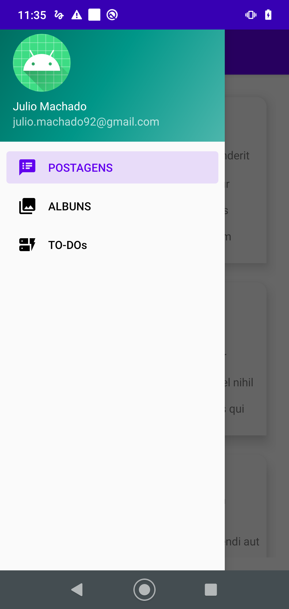
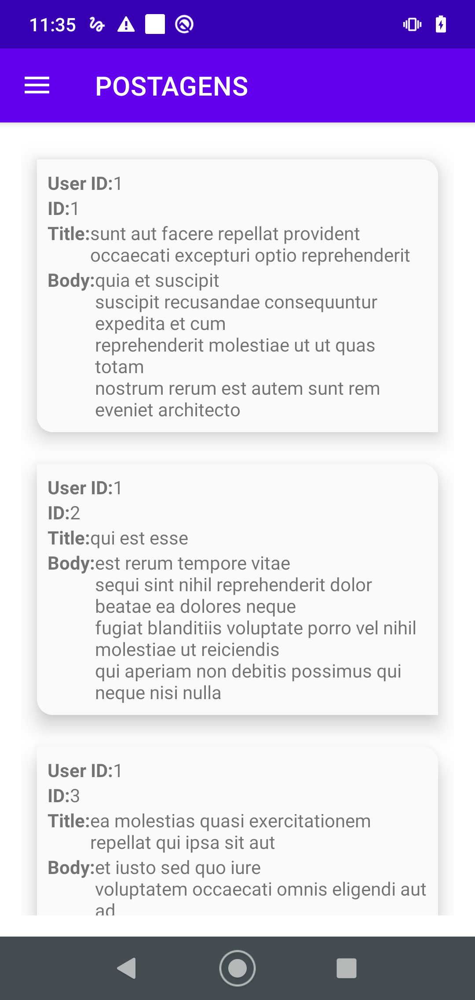
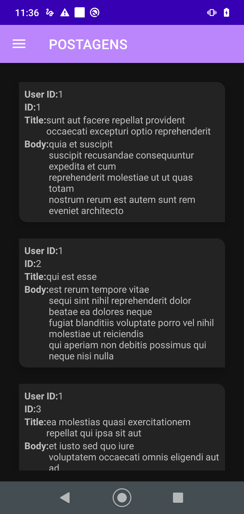
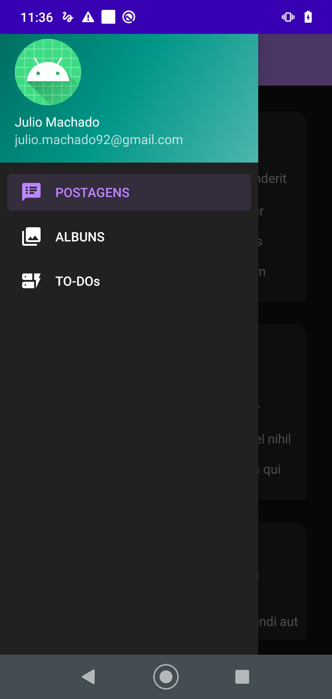

# Place-Holder-API
Exemplo de aplicação em Kotlin que utiliza a API {JSON} Placeholder

### ESCOPO DO PROJETO ###

Construção de  uma aplicação Android que irá sincronizar as listagens da API Rest para o banco local ao iniciar a aplicação.
A API a ser utilizada está publicada em https://jsonplaceholder.typicode.com/
Esta aplicação deve contem os menus:

* POSTAGENS
* ALBUNS
* TO-DOs

### Bibliotecas utilizadas ###

* Retrofit - Para Requisições externas
* Coroutines - Para métodos assíncronos de alta performance
* Livedata - Para usar como um observable
* Coil - Para baixar imagens externas
* Material Desing - Para desing de componentes
* CardView - Como item de lista 
* RecicleView - Para exibição de uma lista dinâmica

### Utilização ###

* Clone o repositorio em sua maquina
* Abra o Android Studio vesão 4.1+
* Tenha o SDK Android instalado (Versão mim. 24 Versão de compilação 30)
* Abra o Projeto que clonou
* Aguarde o Gradle finalizar a importação
* Faça a construção da aplicação (Make Project)
* Execute o app em seu dispositivo ou emulador(Run app)
* Na primeira execução esteja conectado a internet para baixar os dados da API
* Se estiver online aplicação ira baixar aos dados de Postagens, Albuns e ToDo-s
* A aplicação abre na tela tela de postagem
* Ao Clicar no menu Lateral tem as opções para navegar entre as paginas

### Screenshots ###

